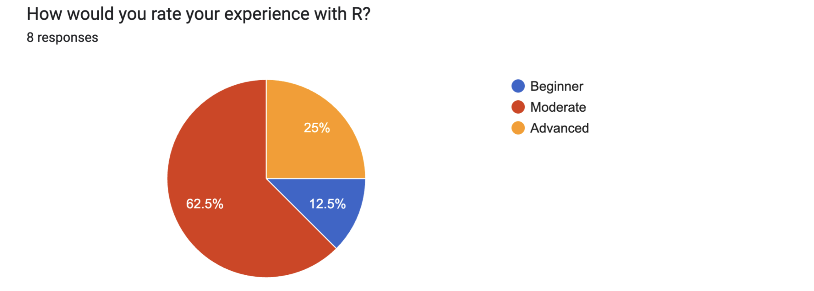
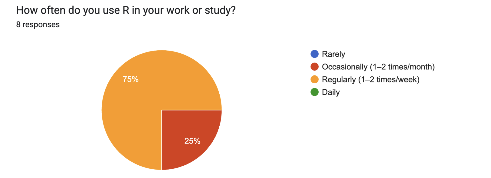
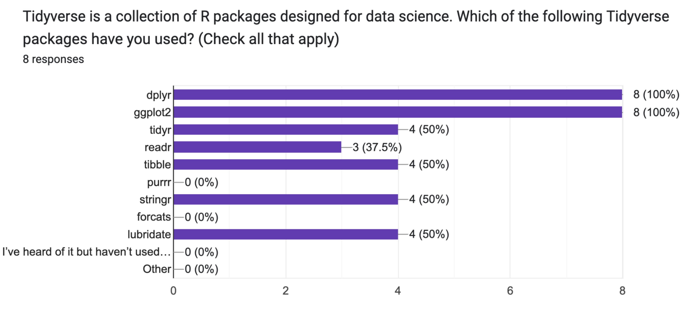
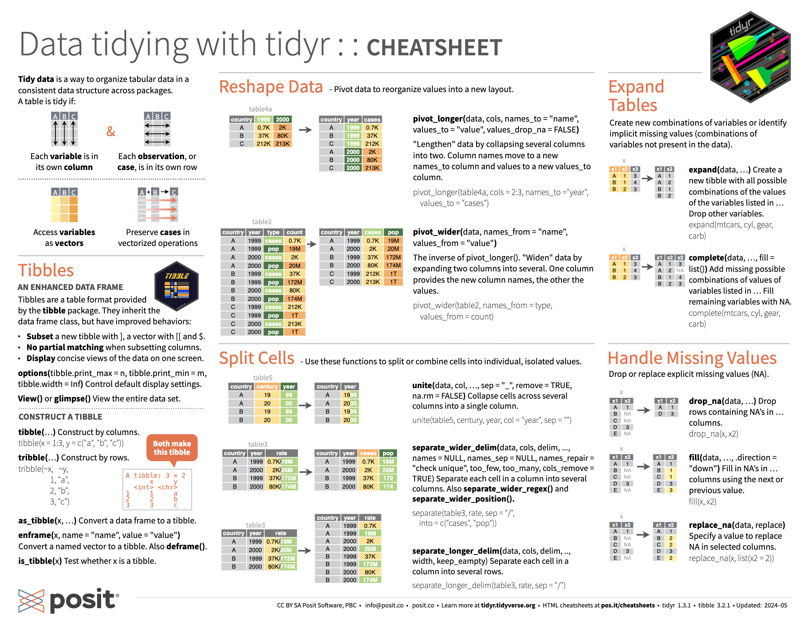
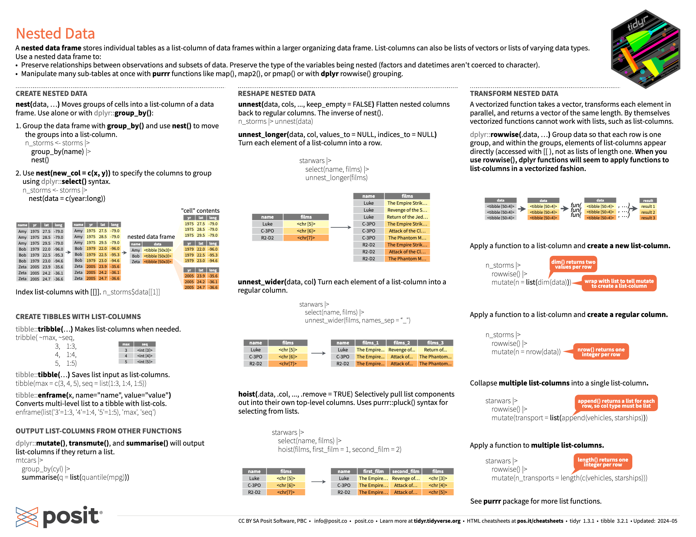
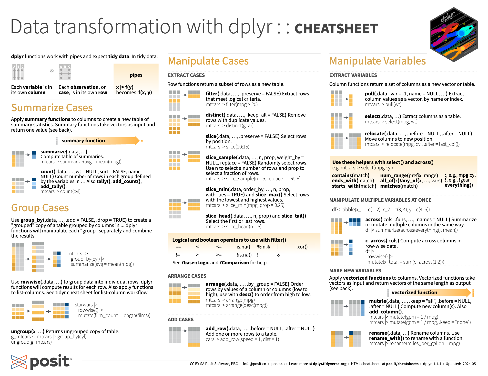
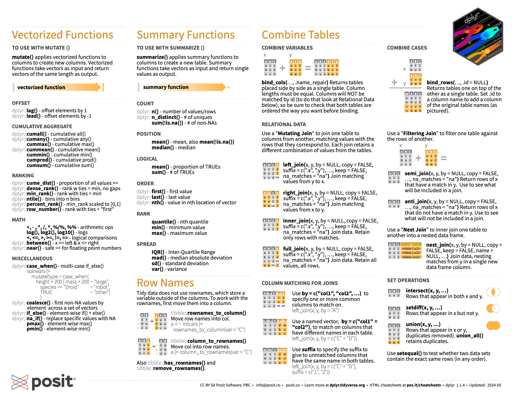
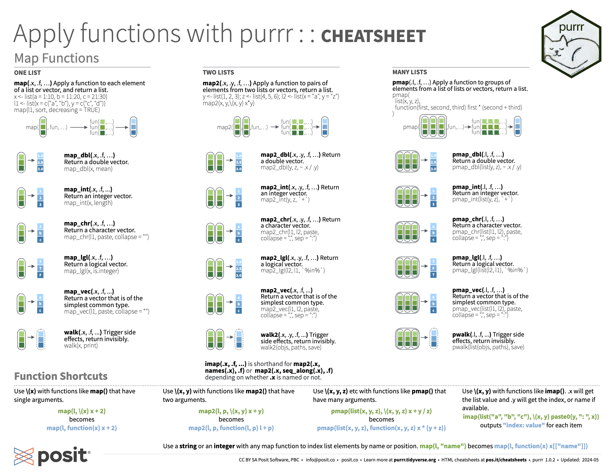
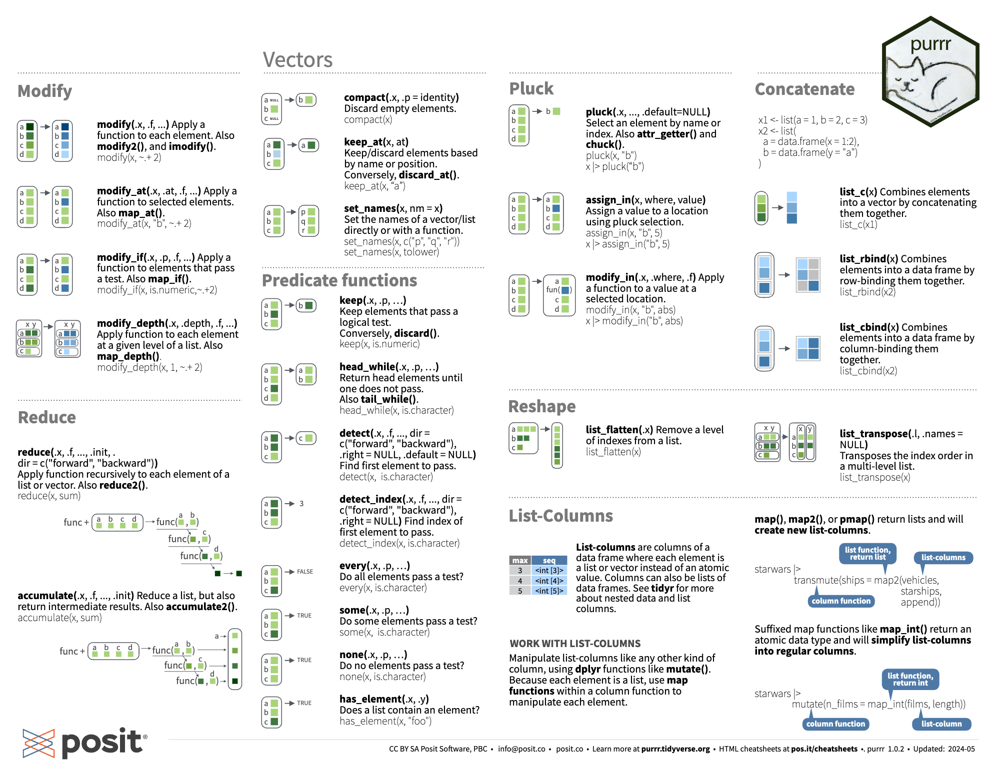

```{r setup, include=FALSE}
knitr::opts_chunk$set(echo = TRUE)
```

------------------------------------------------------------------

### Tidyverse 

The tidyverse is an opinionated collection of R packages designed for data science. All packages share an underlying design philosophy, grammar, and data structures.

Tidyverse https://www.tidyverse.org/ 

R for Data Science (2e) https://r4ds.hadley.nz/ 

```{r, results="hide"}
#install.packages("tidyverse")
library(tidyverse)
```

**Tidyverse Packages**

- `ggplot2` Data visualization: create elegant and layered plots using the grammar of graphics.

- `dplyr` Data manipulation: filter, summarize, and transform data with clear, readable syntax.

- `tidyr` Data tidying: reshape messy data into a tidy format (long vs. wide).

- `readr` Data import: read rectangular text data (like CSVs) into R quickly and cleanly.

- `purrr` Functional programming: apply functions consistently over lists and vectors.

- `tibble` Modern data frames: simplified, user-friendly version of R’s base data.frame.

- `stringr` String manipulation: handle and transform text data with consistent string functions. 

- `forcats` Categorical data: tools for working with factors (ordered or unordered categories).

- `lubridate` Date-time handling: simplify parsing, manipulating, and extracting components of dates and times.

------------------------------------------------------------------

### Pre-Seminar Survey 

- R Experience Level: Most people (62.5%) rate themselves as having moderate experience with R, followed by 25% advanced and 12.5% beginner. 
- R Usage Frequency: 75% people use R regularly (1-2 times per week), while 25% use it occasionally (1-2 times per month).
- Common Data Types/Projects: People have used R for a diverse range of data/projects, including ecological, microbial, genomic, plant growth, environmental measurements, and Bayesian models.
- Interest Topics in Tidyverse: People are interested in improving their skills in data wrangling, summarization, and learn more about specific packages like purrr, lubridate, and tibble. Several also mentioned wanting to understand/use the pipe (%>%) better. 
- Familiarity with Tidyverse Packages: Everyone have used dplyr and ggplot2. Around half have used tidyr, tibble, stringr, and lubridate, but none have used purrr or forcats.

```{r, echo=FALSE, out.width="70%"}



```

------------------------------------------------------------------

### Tidy Data

Tidy data is structured to make analysis and manipulation easier, and Tidyverse is designed to work with tidy data.

**Principles of tidy data:** 

- Each variable is in its own column
- Each observation is in its own row
- Each type of observational unit forms a table

Tidy Data https://www.jstatsoft.org/article/view/v059i10 

```{r, echo=FALSE, out.width="100%"}
knitr::include_graphics("tidydata.png")
```

------------------------------------------------------------------

### Package: tidyr

`tidyr` helps you organize and clean data by transforming it into a tidy format: each variable is in its own column, each observation in its own row. It includes tools for reshaping, separating, uniting, and nesting columns in data frames.

https://tidyr.tidyverse.org/

**Functions**

- `pivot_longer()` Convert wide data to long format 
- `pivot_wider()` Convert long data to wide format   
- `separate()` Split a column into multiple columns
- `unite()` Combine multiple columns into one      
- `drop_na()` Remove rows with missing values     
- `replace_na()` Replace missing values with specified values    
- `nest()` Collapse grouped data frames into list-columns 
- `unnest()` Expand list-columns back into rows      

**Tidyr Example 01**

Pivoting wider to longer

```{r}
tidyr_data <- tibble(
  id = 1:3,
  treatment_A = c(2, 4, 3),
  treatment_B = c(5, 6, 7)
)

print(tidyr_data)

# Convert to long format
pivoted_tidyr_data <- tidyr_data %>%
  pivot_longer(cols = starts_with("treatment"),
               names_to = "treatment",
               values_to = "response")

print(pivoted_tidyr_data)
```

**Tidyr Example 02**

```{r}
tidyr_data2 <- tibble(
  sample = c("Leaf_1", "Leaf_2", "Root_1"),
  measurement = c("N:1.5", "N:1.7", "N:0.9"))

print(tidyr_data2)

# Separate 'measurement' into nutrient and value, and widen the data
cleaned_tidyr_data2 <- tidyr_data2 %>%
  separate(measurement, into = c("nutrient", "value"), sep = ":") %>%
  mutate(value = as.numeric(value)) %>%
  pivot_wider(names_from = nutrient, values_from = value)

print(cleaned_tidyr_data2)
```

**Tidyr Tips**

- Check the structure after reshaping with `glimpse()` or `str()`.
- `pivot_longer()` is useful for messy spreadsheets or repeated measures.
- `pivot_wider()` is helpful when you want summary tables or features as columns.
- `separate()` is great for parsing encoded column names.
- Use `unite()` to rebuild structured labels from columns.

**Tidyr Cheatsheet**

```{r, echo=FALSE, out.width="100%"}


```

------------------------------------------------------------------

### Package: dplyr 

dplyr is a grammar of data manipulation, providing a consistent set of verbs that help you solve the most common data manipulation challenges. 

https://dplyr.tidyverse.org/ 

**Functions**

- `mutate()` adds new variables that are functions of existing variables
- `select()` picks variables based on their names.
- `filter()` picks cases based on their values.
- `summarise()` reduces multiple values down to a single summary.
- `arrange()` changes the ordering of the rows.
- `group_by()` groups rows by a variable (for summarizing)
- `across()` applys function to multiple columns  
- `distinct()` gets unique rows 
- `rename()` renames columns

**Pipe %>%** 

Pipes in R allow you to link a sequence of data transformation steps in a clear and readable way. The `%>%` operator takes the output of the expression on its left and passes it as the first argument to the function on its right. This chaining makes your code more concise, expressive, and easier to follow, especially for multi-step analyses.

```{r}
# without pipe
mean(log(mtcars$mpg))

# with pipe
mtcars$mpg %>%
  log() %>%
  mean()
```

**Pipe %>% Example 01**

```{r}
# orignial dataset: built-in "starwars"
#head (starwars)

#show column names 
colnames(starwars)

# show summary of starwars 
starwars %>%
  select(where(~ !is.list(.))) %>%
  summary()
```

```{r}
# use as.factor() and summary() to show number of unique value each character variables
# this can be useful to check some filter() results
starwars$hair_color <- as.factor(starwars$hair_color)
starwars$eye_color <- as.factor(starwars$eye_color)
starwars$skin_color <- as.factor(starwars$skin_color)
starwars$gender <- as.factor(starwars$gender)
starwars$sex <- as.factor(starwars$sex)
starwars$homeworld <- as.factor(starwars$homeworld)
starwars$species <- as.factor(starwars$species)

starwars %>%
  select(where(~ !is.list(.))) %>%
  summary()
```


```{r}
# creating a new sub-dataset "starwars_subset" using pipe %>%
starwars_subset <- starwars %>%
  select(name, species, homeworld, mass, height) %>% 
  filter(!is.na(mass), !is.na(height)) %>%
  filter(species == "Human") %>%
  mutate(BMI = mass / (height/100)^2) %>%
  arrange(desc(BMI))

# check is species only has human 
summary(starwars_subset)
```

**Pipe Tips**

- If your pipes have a lot of steps (e.g. more than 10 pipes), create intermediate objects with meaningful names, which will be helpful for checking and debugging 
- Don't use pipe if you have multiple inputs or outputs.
- Use `.` if needed to refer back to the original data explicitly.
- Use `glimpse()` or `summary()` to inspect data before and after.
- Add `count()` or `n_distinct()` to check expected levels.
- Include `stopifnot()` for sanity checks in scripts.
- Use `janitor::clean_names()` to tidy column names early.
- Use `group_by()` + `summarize()` for grouped calculations.
- Use `ungroup()` after grouped operations to avoid accidental carryover.

**Sanity Check**

A sanity check is a quick, basic test to ensure that your data or results make sense before moving forward in an analysis.

A sanity check helps:

- Catch obvious mistakes (e.g., negative heights, missing groups)
- Verify assumptions (e.g., no missing values, correct number of rows)
- Ensure intermediate steps didn’t introduce errors

Example sanity checks:

- Are there missing values? `stopifnot(!any(is.na(my_data)))`
- Do we have the expected number of groups? `stopifnot(n_distinct(my_data$group) == 3)`
- Are all expected categories present? `stopifnot(all(c("A", "B", "C") %in% unique(my_data$category)))`

**Pipe %>% Example 02**

Step-by-step pipeline with quality control

```{r}
#install.packages("janitor")
library(janitor) # for the use of janitor::clean_names()
```

```{r}
# take a look at the orginal `iris` dataset
head(iris)

# use ?iris to get more information about the `iris` dataset
```

```{r}
iris_cleaned_summary <- iris %>%
  # Step 1: Inspect original data
  { print("Original summary:"); print(summary(.)); . } %>%

  # Step 2: Clean column names for consistency
  clean_names() %>%
  
  # Step 3: Remove biologically implausible values (e.g., petal length must be > 0)
  filter(petal_length > 0, sepal_length > 0) %>%
  
  # Step 4: Add petal-to-sepal ratio
  mutate(petal_sepal_ratio = petal_length / sepal_length) %>%
  
  # Step 5: Run a QC check: make sure no missing values were introduced
  { stopifnot(!any(is.na(.))); . } %>%

  # Step 6: Group by species and summarize
  group_by(species) %>%
  summarize(
    avg_ratio = mean(petal_sepal_ratio),
    max_petal = max(petal_length),
    n = n(),
    .groups = "drop"
  ) %>%

  # Step 7: Final sanity check – make sure all species are present
  { stopifnot(all(c("setosa", "versicolor", "virginica") %in% .$species)); . }

print(iris_cleaned_summary)
```

**dplyr Cheatsheet**

```{r, echo=FALSE, out.width="100%"}


```

------------------------------------------------------------------

### Package: tibble 

`tibble` is a modern reimagining of the base R `data.frame`. It improves usability and consistency within the Tidyverse. Tibbles are part of the `tibble` package, and they print more cleanly, never change variable names, and are stricter in subsetting behavior.

https://tibble.tidyverse.org/

**tibble vs. data.frame vs. matrix**

| Feature          | tibble                    | data.frame                | matrix                      |
|------------------|---------------------------|---------------------------|-----------------------------|
| Print behavior   | Prints nicely, shows type | Prints all rows & columns | Prints all values           |
| Column types     | Can be mixed              | Can be mixed              | **Must be same type**       |
| Row names        | Never uses row names      | Often uses row names      | Uses row/column indices     |
| Subsetting       | Stricter, clearer errors  | May return ambiguous results | Matrix-style indexing only |
| Integration      | Works smoothly with pipes | Less consistent           | Not part of Tidyverse       |

**Functions**

- `tibble(...)` create a tibble from vectors
- `as_tibble(x)` convert data to a tibble
- `tribble(...)` manually enter data row-by-row
- `glimpse(x)` compact data preview
- `enframe()` / `deframe()` convert between named vectors and tibbles

**Tibble Example 01** 

Convert the built-in dataset `iris`

```{r}
# convert iris to tibble and preview
iris_tbl <- as_tibble(iris)
head(iris_tbl)

# show a compact overview of the data
glimpse(iris_tbl)
```

**Tibble Example 02**

Create  a tibble from scratch, calculating a derived column, and performing grouped summarization using tidyverse-friendly syntax.

```{r}
# create the data_tbl
data_tbl <- tibble(
  species = rep(c("A", "B", "C"), each = 4),
  height_cm = runif(12, 30, 100),
  width_cm = runif(12, 5, 30)
)

# add area column and summarize by species
data_tbl %>%
  mutate(area = height_cm * width_cm) %>%
  group_by(species) %>%
  summarize(mean_height = mean(height_cm),
            total_area = sum(area))
```

------------------------------------------------------------------

### Package: lubridate

`lubridate` simplifies working with dates and times in R. It provides intuitive functions to parse, manipulate, and extract components from date/time objects, which are often frustrating to handle with base R.

https://lubridate.tidyverse.org/

`lubridate` can: 

- Makes it easy to parse strings into date-time objects
- Allows you to extract parts of a date (like year or weekday)
- Supports arithmetic (add days, subtract weeks)
- Handles time zones and intervals more gracefully than base R

**Parsing of Date-Times**

```{r}
# Year-Month-Day
ymd(20101215)                 # 2010-12-15
ymd("2023-08-01")            # "2023-08-01"
ymd("20230801")              # Also works without dashes

# Month-Day-Year
mdy("4/1/17")                # "2017-04-01"
mdy("12-25-2020")            # "2020-12-25"

# Day-Month-Year
dmy("15/03/2022")            # "2022-03-15"
dmy("01-08-2021")            # "2021-08-01"

# Date-time parsing with hours, minutes, seconds
ymd_hms("2023-08-01 12:45:33")   # POSIXct with time
mdy_hms("04/01/17 08:30:00")     # "2017-04-01 08:30:00"
dmy_hms("31-12-2022 23:59:59")   # "2022-12-31 23:59:59"

# With time zone
ymd_hms("2023-06-15 14:00:00", tz = "America/Los_Angeles")
```

**Date Arithmetic**:

- `today() + days(7)` – add days
- `now() - hours(3)` – subtract hours
- `interval(start, end)` – define and work with time intervals

```{r}
# Current date and time
today()            
now()                
```

```{r}
# Adding or Subtracting Time

# Add 7 days to today
today() + days(7)        

# Subtract 3 hours from now
now() - hours(3)       

# Add months or years
ymd("2024-06-15") + months(3)
ymd("2020-01-01") + years(5)   
```

```{r}
# Using Intervals and Durations

# Define a time interval
start <- ymd("2023-01-01")
end <- ymd("2024-01-01")
my_interval <- interval(start, end)

# Duration in days
as.duration(my_interval) / ddays(1)     # 365 days

# Is today within the interval?
today() %within% my_interval            # TRUE or FALSE
```

```{r}
#Comparing or shifting time

# Difference between two times
difftime(now(), now() - days(2), units = "hours")  # 48 hours

# Round down/up to nearest unit
floor_date(now(), "month")     # Start of current month
ceiling_date(now(), "week")    # Start of next week
```

**Extract Components**

- `year(date)`, `month(date)`, `day(date)`
- `wday(date, label = TRUE)`, `hour(time)`

```{r}
my_date <- ymd_hms("2024-11-15 14:45:30")

year(my_date)      # 2024
month(my_date)     # 11
day(my_date)       # 15

# Get weekday (numeric and labeled)
wday(my_date)                  # 6 (Friday)
wday(my_date, label = TRUE)    # "Fri"

# Extract hour, minute, second
hour(my_date)     # 14
minute(my_date)   # 45
second(my_date)   # 30
```

**Rounding and Flooring**

- `floor_date(date, "month")` – round down to nearest month
- `ceiling_date(date, "week")` – round up to next week

```{r}
now_time <- ymd_hms("2024-04-28 11:23:45")

floor_date(now_time, "month")    # "2024-04-01 00:00:00"
floor_date(now_time, "hour")     # "2024-04-28 11:00:00"

ceiling_date(now_time, "week")   # "2024-05-05 00:00:00"
ceiling_date(now_time, "day")    # "2024-04-29 00:00:00"
```

**Other Utilities**

- `with_tz()` and `force_tz()` – adjust time zones
- `make_date(year, month, day)` – build dates from components

```{r}
# Adjust time zones
time_utc <- ymd_hms("2024-04-28 14:00:00", tz = "UTC")

with_tz(time_utc, "America/Los_Angeles")   # Convert to a different zone (displays in new tz)
force_tz(time_utc, "America/Los_Angeles")  # Force to treat as if it were recorded in new tz

# Build a date from components
make_date(2023, 12, 31)    # "2023-12-31"
make_datetime(2023, 12, 31, 23, 59, 59)  # "2023-12-31 23:59:59"
```

**Lubridate Example 01**

```{r}
# Simulated timestamped data

set.seed(123)

sensor_data <- tibble(
  timestamp = ymd_hms("2024-01-01 00:00:00") + hours(sample(0:200, 50, replace = TRUE)),
  temperature = rnorm(50, 20, 2))

head(sensor_data)
```

```{r}
#Multi-step Pipeline Using lubridate and %>%
sensor_data %>%
  mutate(hour = hour(timestamp)) %>%                # Step 1: Extract hour of day
  filter(hour >= 6 & hour <= 18) %>%                # Step 2: Keep daytime readings
  group_by(date = date(timestamp)) %>%              # Step 3: Group by day
  summarize(mean_temp = mean(temperature))          # Output: Daily mean temp (daytime only)
```

------------------------------------------------------------------

### Package: purrr

`purrr` enhances R’s functional programming (FP) toolkit by providing a complete and consistent set of tools for working with functions and vectors." 

https://purrr.tidyverse.org/ 

**Functions**

One example of the functional programming (FP) toolkit is the family of `map()` functions. The map() functions transform their input by applying a function to each element of a list or atomic vector and returning an object of the same length as the input. 

- `map()` always returns a list. 
- `map_lgl()`, `map_int()`, `map_dbl()`, and `map_chr()` return an atomic vector of the indicated type (or die trying). For these functions, .f must return a length-1 vector of the appropriate type.
- `map_vec()` simplifies to the common type of the output. It works with most types of simple vectors like Date, POSIXct, factors, etc.
- `walk()` calls .f for its side-effect and returns the input .x.

Usage:

- `map(.x, .f, ..., .progress = FALSE)`
- `map_lgl(.x, .f, ..., .progress = FALSE)`
- `map_int(.x, .f, ..., .progress = FALSE)`
- `map_dbl(.x, .f, ..., .progress = FALSE)`
- `map_chr(.x, .f, ..., .progress = FALSE)`
- `map_vec(.x, .f, ..., .ptype = NULL, .progress = FALSE)`
- `walk(.x, .f, ..., .progress = FALSE)`

`.x`: A list or atomic vector.

`.f`: A function, specified in one of the following ways: 

- A named function, e.g. mean.
- An anonymous function, e.g. `\(x) x + 1 or function(x) x + 1`
- A formula, e.g. `~ .x + 1`. You must use .x to refer to the first argument. Only recommended if you require backward compatibility with older versions of R.
- A string, integer, or list, e.g. `"idx"`, `1`, or `list("idx", 1)` which are shorthand for `\(x) pluck(x, "idx")`, `\(x) pluck(x, 1)`, and `\(x) pluck(x, "idx", 1)` respectively. Optionally supply .default to set a default value if the indexed element is NULL or does not exist.

**Purrr Example 01**

Use `purrr` to summarize selected variables (mpg, hp, wt) in the `mtcars` dataset by calculating the mean and standard deviation

```{r}
# take a look at this build-in "mtcars" dataset
head(mtcars)

# use ?mtcars to get more information about the dataset 
```

```{r}
# Select specific numeric columns
vars <- mtcars %>% select(mpg, hp, wt)
# Calculate mean of each column
map_dbl(vars, mean)
# Calculate standard deviation of each column
map_dbl(vars, sd)
```

**Purrr Example 02**

Use `purrr` to split the `mtcars` dataset into pieces, fit a model to each piece, compute the summary, and then extract the R^2 values.

```{r}
mtcars %>% 
  split(mtcars$cyl) %>%  
  map(\(df) lm(mpg ~ wt, data = df)) %>%  
  map(summary) %>% 
  map_dbl("r.squared")
```

Line-by-line breakdown:

- Line 1: `mtcars %>%`
Starts with the built-in mtcars dataset.
Passes it into the next function using the pipe %>%.
- Line 2: `split(mtcars$cyl)`
Splits mtcars into a list of smaller data frames based on the number of cylinders (cyl).
Result: a list with 3 elements, one for each `cyl` value (4, 6, 8).
- Line 3: `map(\(df) lm(mpg ~ wt, data = df))`
For each data frame df in the list:
Fit a linear model predicting mpg from wt (miles per gallon ~ weight).
`\(df)` is a shorthand for an anonymous function, equivalent to function(df).
Result: a list of 3 lm model objects.
- Line 4: `map(summary)`
Applies `summary()` to each lm object.
Result: a list of summary.lm objects that contain model details like coefficients, residuals, and R-squared.
- Line 5: `map_dbl("r.squared")`
Extracts the r.squared value (a numeric) from each summary object.
`map_dbl()` simplifies the result to a numeric vector.

This example shows some of the advantages of purrr functions:

- Purrr works naturally with the pipe.
- All purrr functions are type-stable. They always return the advertised output type (`map()` returns lists; `map_dbl()` returns double vectors), or they throw an error.
- All `map()` functions accept functions (named, anonymous, and lambda), character vector (used to extract components by name), or numeric vectors (used to extract by position).

**Purrr Example 03**

Use `purrr` to split the `mtcars` dataset by number of cylinders (cyl). For each group, fit a linear model predicting mpg from both wt and hp and extract model coefficients, R-squared, and p-value for wt. Return the results in a clean tibble. 

```{r}
# step 1: split mtcars into a list by 'cyl'
purrr_models <- mtcars %>%
  split(.$cyl) %>%
  map(~ lm(mpg ~ wt + hp, data = .x))  # step 2: fit linear model for each group

# step 3: extract model summaries
purrr_results <- tibble(
  cyl = names(purrr_models),
  r_squared = map_dbl(purrr_models, ~ summary(.x)$r.squared),
  wt_p_value = map_dbl(purrr_models, ~ summary(.x)$coefficients["wt", "Pr(>|t|)"]),
  wt_estimate = map_dbl(purrr_models, ~ coef(.x)["wt"]),
  hp_estimate = map_dbl(purrr_models, ~ coef(.x)["hp"])
)

print(purrr_results)
```

**purrr Cheatsheet**

```{r, echo=FALSE, out.width="100%"}


```

------------------------------------------------------------------

### Book: R for Data Science

To learn more about `tidyverse` with the book “R for Data Science (2e)". 

It's free online! https://r4ds.hadley.nz/ 

```{r, echo=FALSE, out.width="50%"}
knitr::include_graphics("R_for_Data_Science.png")
```
